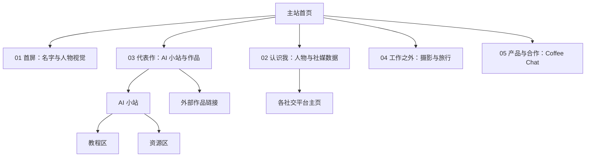
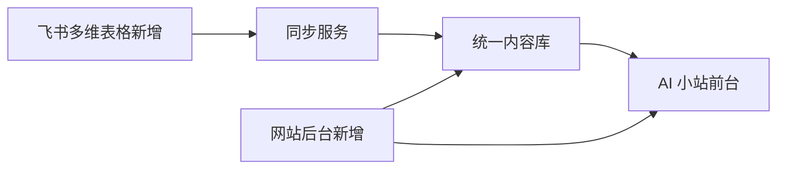

# 阿晔 / Qurious 个人网站策划与需求文档 V0.3

> 文档状态：第一步 / 内容与风格锁定（主体方向与关键产品规则已确认，文案和社媒资料待补）  
> 当前用途：统一页面结构、内容、交互、素材和后续执行标准  
> 本版只完善需求与素材判断，不包含网页开发，也不代表视觉稿已经定稿

---

## 1. 项目摘要

### 1.1 要做什么

制作一个有鲜明个人辨识度的个人网站，用一条连续向下滚动的叙事，让访客依次完成五件事：

1. 第一眼知道“你是谁”；
2. 用社交媒体数据快速建立信任；
3. 看到你的代表作与 AI 小站；
4. 认识工作之外更真实的你；
5. 通过 Coffee Chat、微信或 AI 群与你建立联系。

网站包含两个层级：

- **主站**：一个连续滚动的五屏首页，是核心个人名片。
- **AI 小站**：主站之外的独立页面，承载教程区和资源区。

### 1.2 推荐的站点定位

推荐定位为：**以个人 IP 为第一目标的创作者主页 + 作品集 + AI 内容入口 + 社群与合作转化页**。

它不是传统简历网站，也不只是作品列表。首页要同时完成“认识你、相信你、继续看、愿意联系你”四件事。

### 1.3 主要访客

- 第一优先：从社交媒体进入，希望快速认识阿晔 / Qurious 的新访客；
- 第二优先：已关注内容、想继续学习 AI 工具或加入 AI 群的人；
- 第三优先：潜在品牌方、产品方和合作伙伴；
- 招聘或职业机会不是首版的主要叙事目标。

### 1.4 希望访客记住的三件事

1. 你是一个持续做 AI 工具实战内容的人，而不是只转发资讯的人；
2. 你有真实的平台数据和代表作；
3. 你既有专业能力，也有摄影、旅行等个人生活质感，并且愿意与人交流合作。

---

## 2. 本文档使用的资料

### 2.1 本次明确提供

- 你对网站整体结构、五个主站界面和 AI 小站的口述说明；
- 6 张手绘结构草图：首屏、社交数据、代表作、工作之外、产品合作、AI 小站；
- 你提出的核心视觉元素：人物立体效果、人物粒子效果、大图、双栏布局、图片拼贴、Coffee Chat。

### 2.2 已确认沿用的资料

下列资料来自现有个人网站原型，并已由你确认继续沿用：

- 本名：何晨晔；
- 英文个人 IP：Qurious；
- 中文个人 IP：阿晔；
- 定位：AI 工具实战派 · 内容创作者；
- 候选格言：`slow is fast, done than peffect,everything has a price`；
- 微信号：`_policeuncle`；
- AI 群说明：添加微信时备注「ai」；
- 已有平台入口：小红书、抖音、哔哩哔哩、视频号；
- 已有内容方向：Claude Code 教程、CC Switch 指南、Codex、storage-analyzer 等；
- 已有一张个人照片、三张高分辨率摄影作品和一条 X 平台代表作链接。

### 2.3 本轮新增并已确认

- 网站第一目标：建立个人 IP；
- 站点形态：五屏滚动主站 + 独立 AI 小站；
- 顶部导航：作品集、认识我、交个朋友均为主站内跳转，AI 小站单独成页；
- 首页人物：真实照片 + 2.5D 景深 + 粒子效果；
- “认识我”：参考 David Heckhoff 网站中段，使用可互动的 3D 小人；
- 3D 小人以何晨晔本人为原型，不采用独立吉祥物路线；
- 主站视觉：参考 Everlight AI 的编辑杂志式风格，并吸收 identity-skill 中 Links 摄影博主案例的摄影叙事方向；
- 当前代表作：一条 X 平台作品；
- Coffee Chat 与合作交流属于同一个最终区块；
- Coffee Chat 点击后展示微信号 / 微信二维码；
- 最终区块增加“加入 AI 群”，¥9.9 为一次性入群费；
- 首版通过微信人工收款，不接在线支付；
- AI 小站需要支持后续持续新增教程和资源，并同时支持“飞书新增”和“网站后台新增”；
- David 3D 参考站的公开源码仓库已补充为 `https://github.com/davidhckh/portfolio-2025`；
- 已收到首页人物照片 `个人网页素材/首页图.jpg`；
- 已收到摄影目录中的 3 张作品：`02.png`、`1000114630 (2).jpg`、`1000114649 (2).jpg`。

### 2.4 素材解释边界

- 首页照片只用于确认你的外形、服装轮廓和人物素材可用性；
- 照片背景中的会议议程、公司名、岗位名和其他文字只是拍摄现场背景，不作为你的个人经历、任职信息或网站文案；
- 摄影作品按你提供的作品素材处理，不根据画面擅自推断地点、年份、同行人物或旅行经历；
- 在你补充正式说明前，照片只使用中性描述，不添加未经确认的故事。

### 2.5 尚未确认

- 首屏格言和正式中英文文案；
- 每个平台的最新数据与主页链接；
- 当前 X 代表作的正式标题、一句话说明与可公开数据；文章原封面已确认使用；
- 微信二维码、AI 群权益说明和公开邮箱；
- 3D 小人所需的侧面、背面或更高清人物参考照；
- 摄影作品的正式标题、地点和年份（如希望公开）；
- 飞书内容表的实际归属账号，以及后台管理员账号方案。

---

## 3. 推荐的网站结构



### 3.1 页面数量建议

推荐首版只做两个正式页面：

1. `/`：五屏连续滚动的主站；
2. `/ai`：AI 小站。

作品集、认识我和交个朋友先作为主站锚点，不额外拆页。这样访问路径更短、维护成本更低，也更符合你画的连续下滑结构。

如果以后某个代表作有足够完整的背景、过程和结果，可以再增加独立案例页，不必在首版提前做空页面。

---

## 4. 主站整体体验

### 4.1 页面叙事顺序

| 顺序 | 页面区块 | 访客此时要得到的答案 | 主要动作 |
| --- | --- | --- | --- |
| 01 | 首屏 | 你是谁、做什么、气质如何 | 继续下滑或点击导航 |
| 02 | 认识我 | 你在哪些平台做内容、影响力如何 | 打开社媒主页 |
| 03 | 代表作 | 你具体做过什么、哪里能继续看 | 进入 AI 小站或打开作品 |
| 04 | 工作之外 | 你是一个怎样的人 | 浏览摄影与旅行照片 |
| 05 | 产品与合作 | 如何联系你、如何加入社群 | 发起 Coffee Chat、加微信、进 AI 群 |

### 4.2 顶部导航

桌面端右上角建议保留四个入口：

- 作品集：滚动到“代表作”；
- AI 小站：打开独立 AI 小站；
- 交个朋友：滚动到“产品与合作”；
- 认识我：滚动到“认识我”。

推荐行为：

- 导航在首屏中视觉轻盈，滚动后保持可见；
- 当前区块对应入口出现轻微高亮；
- 站内跳转使用平滑滚动；
- AI 小站是唯一默认打开新页面的入口；
- 手机端折叠成一个简洁菜单。

该导航方式已经确认：作品集、交个朋友、认识我均在首页内跳转，只有 AI 小站进入独立页面。

---

## 5. 五个主站区块的详细规格

## 5.1 第一屏：名字与人物视觉

### 目的

在 3 秒内让访客记住你的名字、身份方向和鲜明的人物形象。

### 桌面端构图

- 页面主体分成左右两大块，比例建议约为 `45 : 55`；
- 左侧：名字、身份标签或格言；
- 右侧：人物立体视觉，是全屏第一焦点；
- 导航位于右上角，但不与人物头部重叠；
- 首屏高度接近一个完整屏幕，底部可露出少量下一屏内容，提示访客继续下滑。

### 左侧内容建议

必需内容：

- 中文名；
- 英文名或账号名（可选）；
- 一句清晰身份说明；
- 一句格言或个人表达。

这里所说的“首屏文案”，就是访客打开网站后第一眼看到的这组文字，不是整篇个人介绍。它需要在 3 秒内回答：你叫什么、你做什么、你的表达气质是什么。

已确认的名称层级：

```text
阿晔 / QURIOUS
何晨晔
AI 工具实战派 · 内容创作者
一句属于你的短格言
```

使用规则：

- “阿晔”是中文主称呼，承担亲切感和口播记忆；
- “QURIOUS”是英文标志，与现有账号保持连续；
- “何晨晔”作为真实姓名，用较小层级出现在首屏、简介或合作信息中；
- 不再使用“何其好奇”“好奇阿晔”“晨晔研究所”等候选名称。

注意：格言应控制在一到两行。旧版英文格言存在拼写和表达问题，建议定稿前统一校正，但不擅自替你改掉原意。

推荐草案（尚未得到最终确认）：

```text
阿晔 / QURIOUS
AI 工具实战派 · 内容创作者

把复杂的 AI 工具，做成普通人也能上手的真实教程。

SLOW IS FAST.
DONE IS BETTER THAN PERFECT.
EVERYTHING HAS A PRICE.
```

其中：

- 第一行是个人 IP 名；
- 第二行是身份标签；
- 第三行是访客能获得什么；
- 最后三句是根据原格言校正后的英文表达，保留“慢就是快、完成胜过完美、万事皆有代价”的原意；
- 如果首屏最终显得文字过多，优先保留前三行，把英文格言缩成一行或移动到页面下方。

### 右侧人物视觉

已确认采用：**真实照片为身份基础 + 2.5D 景深 + 粒子/光点响应**。

原因：

- 保留“这是你本人”的可信度；
- 视觉上能达到立体和未来感；
- 比完整 3D 建模更轻、更快，也更适合手机；
- 后续替换照片时成本更低。

首屏不使用完整 3D 人物。完整 3D 小人只用于下一屏“认识我”，避免两个区块争抢同一个视觉概念。

### 交互建议

- 鼠标移动时人物有轻微景深或视差，不进行夸张旋转；
- 粒子缓慢漂浮，滚动时自然淡出；
- 用户开启“减少动态效果”时，自动显示稳定静态画面；
- 首屏不自动播放有声音的内容。

### 所需素材

- 已有一张人物照片：`个人网页素材/首页图.jpg`；
- 若能补充，优先提供更高分辨率的正面半身照，以及侧面或不同姿势照片；
- 最终姓名、身份句和格言。

### 当前状态

`partially ready`：结构、人物形式和“阿晔 / Qurious”名称层级已确认；现有照片可用于第二阶段参考图和人物身份校准，但最终首屏仍建议补一张高清原图。

现有首页照片检查结果：

| 项目 | 判断 |
| --- | --- |
| 文件 | `个人网页素材/首页图.jpg` |
| 尺寸 | `868 × 953`，约 0.13 MB |
| 人物可见性 | 正面全身、轮廓清楚，白色西装与黑色长裤形成明确识别特征 |
| 适合用途 | 2.5D 人物分层参考、3D 小人正面身份参考、移动端或中小尺寸人物素材 |
| 处理要求 | 分离人物与背景，校正偏暖色调；不保留背景会议文字作为首屏内容 |
| 风险 | 分辨率不足以稳定承担超宽桌面大幅人物；头发和衣服边缘分离需要精细处理 |
| 当前状态 | `replace-later`：可先做参考图，正式上线前优先替换为更高清原图或同造型补拍 |

---

## 5.2 第二屏：认识我与社交媒体数据

### 目的

用真实数据证明你的内容影响力，并给访客明确的平台入口。

### 桌面端构图

- 采用深蓝色全息空间，与其他暖白页面形成一次明确的章节切换；
- 左侧：站在发光圆形底座上的“阿晔 / Qurious”本人卡通化 3D 小人；
- 右侧：社交媒体数据与身份信息面板；
- 页面标题建议为“认识我”或“我在哪里创作”；
- 可在标题附近显示个人网址或一句简短介绍。

### 3D 小人视觉规则

- 参考 David Heckhoff 网站 About 中段的“角色 + 全息扫描 + 信息标注”逻辑，不复制其人物造型；
- 小人明确以何晨晔本人为原型，不采用独立吉祥物；
- 第一版造型从现有照片提取：浅金色中短发、自然中分/侧分、白色西装外套、白色上衣、黑色长裤；
- 相似度优先级为：脸部轮廓与五官比例 > 发型与发色 > 体态与服装 > 装饰物；
- 风格为“本人卡通化”而不是写实数字人，避免恐怖谷，也更容易与全息空间统一；
- 背景使用深海军蓝，地面带透视网格和少量漂浮光点；
- 小人站在青蓝发光底座上，进入区块时由扫描线逐渐显现；
- 人物可以缓慢转身或根据滚动切换姿势，但不要求访客拖拽才能读取信息；
- 角色旁只保留少量身份标注，社交数据仍放在右侧清晰面板中；
- 手机端减少全息扫描和粒子数量，角色置顶，数据置下；
- 最终建模前需要正面、左右侧面和背面参考；当前照片只足够锁定第一版正面造型。

### 数据面板内容

每个平台至少包含：

- 平台名称与图标；
- 账号名；
- 一个最有意义的数字，如粉丝数、获赞与收藏数、播放量；
- 内容类型简述；
- 可点击的平台主页入口；
- 数据更新时间。

建议只展示 3—5 个最重要的平台，避免变成密集报表。

你实际只需要为每个平台提供下面 6 项：

1. 平台名称；
2. 账号名；
3. 主页链接；
4. 粉丝数；
5. 一个平台最有代表性的第二指标；
6. 截图日期或数据更新时间。

推荐展示口径：

| 平台 | 主指标 | 可选第二指标 | 最省力的提供方式 |
| --- | --- | --- | --- |
| 小红书 | 粉丝数 | 获赞与收藏总数 | 主页截图 + 主页链接 |
| 抖音 | 粉丝数 | 获赞总数 | 主页截图 + 主页链接 |
| 哔哩哔哩 | 粉丝数 | 总播放量或获赞数，选一个能核实的 | 主页截图 + 主页链接 |
| 视频号 | 粉丝数 | 获赞数或代表视频播放量，选公开可见的 | 主页截图 + 可打开的主页入口 |
| X | 粉丝数 | 当前代表作的浏览量或互动量 | 主页截图 + 主页链接 |

无需手工整理成表格。最省事的方式是：把准备公开的平台主页分别截一张图，并把对应主页链接一起发来。后续可从截图中提取账号名和公开数据，再由你确认一次。

### 数据真实性规则

- 所有数字必须来自你提供或确认的数据；
- 不用未经确认的估算数；
- 如果平台数据变化频繁，首版允许手动更新；
- 每个数字旁可小字注明“更新于 YYYY.MM”。

### 交互建议

- 鼠标停留时突出当前平台，其余轻微降弱；
- 点击整行或明显按钮即可打开主页；
- 数字进入视野时可以有一次简短递增动画，但最终值必须准确；
- 不使用复杂图表，重点是清晰可信。

### 所需素材和信息

- 各平台官方图标；
- 账号名、主页链接、最新数据和更新时间；
- 现有正面全身照；
- 后续最好补充左右侧面、背面与近距离面部照片；
- 如果服装不沿用白色西装造型，需要在第二阶段前明确新的服装。

### 当前状态

`partially ready`：整体视觉形式与“本人卡通化”身份策略已确认；最新平台数据、链接及更多人物角度仍需补充。

---

## 5.3 第三屏：代表作与 AI 小站入口

### 目的

这是全站最重要的“能力证明区”。访客应同时看到你的长期内容资产和最值得点击的作品。

### 桌面端构图

页面分成左右两大块：

- 左侧约 `45%`：AI 小站主卡，是本区最大单元；
- 右侧约 `55%`：首版放一张面积更大的代表作卡片，不用空卡凑成三条；
- “代表作”作为本区标题；
- AI 小站主卡与代表作卡要形成明确的左右双焦点，但 AI 小站仍是长期内容资产的主要入口；
- 后续新增到 2—3 个代表作时，右侧自动切换为纵向卡片列表，不需要重做整个区块。

### AI 小站主卡

建议包含：

- AI 小站名称；
- 一句话说明，例如“教程、资源与实战工具的长期整理”；
- 一张能代表小站内容的界面图或视觉封面；
- “进入小站”按钮；
- 可选的教程数、资源数或最近更新时间，但必须真实。

点击后进入站内 `/ai` 页面。

### 代表作卡片

首版只展示当前已有的 1 个代表作：

- 来源：[X 平台作品](https://x.com/aiqurious/status/2071213103505870899?s=20)；
- 封面已确认直接使用该文章的原封面，不重新生成另一张封面；
- 正式标题、一句话说明与公开数据仍待确认；
- 不显示“敬请期待”或空白作品卡。

每个作品卡包含：

- 作品封面；
- 作品标题；
- 发布平台；
- 一句内容说明；
- 可选的真实成绩；
- 外部跳转链接。

点击建议：整张卡可点击，并明确提示将前往对应平台。

### 后续作品排序原则

优先级不是“发布时间最新”，而是：

1. 最能代表你现在定位的作品；
2. 最能证明结果或影响力的作品；
3. 能展示不同能力面的作品。

### 所需素材和信息

- AI 小站名称、简介、页面截图或封面；
- 当前 X 作品的文章原封面、正式标题、可公开数据和一句说明；
- 若作品来自不同平台，提供统一裁切后的封面素材。

### 当前状态

`partially ready`：AI 小站结构、当前作品链接及“使用文章原封面”的素材策略已确定；作品标题、一句话说明与数据待补。

---

## 5.4 第四屏：工作之外的我

### 目的

让访客看见专业标签之外的真实生活，增加个人温度和记忆点。

### 桌面端构图

- 标题：“工作之外的我”；
- 首版按现有 3 张真实作品设计，不用空卡凑数量；
- 左侧一张较大的摄影作品，占主要视觉面积；
- 右侧放 2 张大小不同、略有错落的摄影或生活照片；
- 图片之间可以轻微叠放，但人物、建筑和主体不能被遮挡；
- 本屏节奏应比数据区更松，给照片更多呼吸感。

### 内容分组

- 摄影：代表你观察方式的作品；
- 旅行：代表经历、地点或某段记忆的照片；
- 可选：每张图只配极短标题、地点或年份，不写长游记。

### 交互建议

- 点击照片可放大查看；
- 放大后可左右切换；
- 图片说明保持克制；
- 手机端改为一张大图带可横向滑动的小图组，不保留复杂重叠。

### 所需素材和信息

- 已有 3 张摄影作品，足够完成首版三图构图；
- 后续如要增强“旅行”内容，可再补 1—3 张旅行或生活照片；
- 每张照片的标题、地点、年份（可选）；
- 是否允许公开人物面孔与地理信息的确认。

### 当前状态

`ready for reference`：3 张摄影作品已确认作为本次设计素材来源，可以进入第二阶段参考图；标题、地点和年份暂缺时使用中性短标签或不显示说明。

### 现有摄影作品检查与版面建议

| 文件 | 原始尺寸 | 画面判断 | 首版建议位置 | 状态 |
| --- | --- | --- | --- | --- |
| `1000114630 (2).jpg` | `4000 × 2666`，3:2 | 粉色花朵、绿色植被与蓝天，近景主体明确，色彩层次完整 | 左侧主图；保留花朵与上方天空，不裁掉主要花瓣 | `ready` |
| `02.png` | `5568 × 3712`，3:2 | 仰拍秋叶与蓝天，左侧有明显留白，适合承接短标题 | 右侧上方宽图或横向副图；可在天空留白处放极短标签 | `ready`，上线前需压缩 |
| `1000114649 (2).jpg` | `4096 × 2730`，约 3:2 | 两双鞋隔着红白路面标记，俯拍构图有故事感和人物关系 | 右侧下方较小卡片；保留上下两组鞋和红色标记 | `ready` |

使用规则：

- 三张图都保留摄影作品属性，不叠加重滤镜或生成式改写；
- 主站统一调色只做轻量曝光、色温和对比校准；
- `02.png` 原文件约 29.9 MB，其余两张约 4.7 MB 和 9.7 MB，正式上线前必须另存网页优化版本，保留原文件不覆盖；
- 如果未来新增旅行照片，优先替换或扩展右侧图片组，不改变主图焦点。

---

## 5.5 第五屏：产品与合作 / Coffee Chat

### 目的

把“看完网站”转化成一次清晰、轻松、低压力的联系行为。

### 桌面端构图

- 页面标题：“产品与合作”或“产品 · 合作”；
- 中央放置明显的 `Coffee Chat` 主按钮或大卡片；
- 下方展示联系选项：微信、AI 群、公开邮箱（如有）；
- 视觉上收束全站，不再增加新的内容板块。

### Coffee Chat 与合作交流

Coffee Chat、产品合作和日常交流属于同一个最终区块，不再拆成两个界面。

首版交互已经明确：

- 点击 `Coffee Chat` 后展开微信二维码与微信号；
- 展开内容提示访客添加微信并填写备注，例如“Coffee Chat”或“合作”；
- 不强制接入预约日历；以后确实有固定可预约时间，再增加预约入口。

### AI 群入口

Coffee Chat 下方增加第二个清晰入口：

```text
加入阿晔的 AI 群
¥9.9 / 一次性入群
与一群持续实践 AI 工具的人交流
```

首版行为已经确认：

- 点击“¥9.9 加入 AI 群”后，同样展开微信二维码；
- 添加时提示备注“AI 群”；
- 通过微信人工收款，网页不接入在线支付；
- ¥9.9 为一次性入群费，不写“订阅”“每月”或可能引起周期收费误解的表达；
- 正式上线前仍需写清群内提供什么，以及退款、审核或违规移除规则；
- Coffee Chat 与 AI 群使用同一个微信二维码时，通过不同备注区分来意。

### 隐私和防打扰

- 不在页面直接展示私人手机号；
- 微信二维码可点击后再显示，减少页面首屏扫描；
- 如果 AI 群需要审核，应提前写明加入条件；
- 邮箱可使用简单防爬取处理。

### 所需素材和信息

- 微信二维码；
- 微信号和添加备注；
- AI 群加入方式；
- 是否提供公开邮箱；
- 合作类型与不接受的合作边界。
- 群权益、审核和退款说明。

### 当前状态

`partially ready`：区块关系、按钮行为、一次性收费和微信人工收款已明确；二维码、群权益与审核 / 退款说明待补。

---

## 6. AI 小站页面详细规格

## 6.1 页面目标

把分散的教程、工具和下载资源集中在一个长期可维护的入口，让访客不用翻遍社交平台。

## 6.2 页面结构

### 顶部区域

- AI 小站名称；
- 一句清晰说明；
- 返回个人主页入口；
- 可选：最近更新时间或内容总数。

### 教程区

教程卡片建议包含：

- 标题；
- 适用人群；
- 系统或平台；
- 难度；
- 阅读或观看时间；
- 内容形式，如文章、视频、飞书文档；
- 查看教程按钮。

### 资源区

资源卡片建议包含：

- 名称；
- 一句话用途；
- 支持平台；
- 版本或更新时间；
- 来源；
- 下载或访问按钮；
- 必要的安全提示。

## 6.3 首版分类建议

- 教程区：入门安装、工具使用、效率工作流、实战案例；
- 资源区：安装包、工具、Skills、模板或清单。

分类仅在内容数量足够时显示。若首版每区只有少量内容，直接平铺比空分类更好。

## 6.4 更新方式建议

已确认 AI 小站需要长期新增内容，并同时提供两种入口：

1. **飞书新增**：日常在飞书多维表格中像填表一样新增教程或资源；
2. **网站后台新增**：登录简易管理后台，直接新增、编辑、发布或下架内容。

两种入口必须进入同一份网站内容库，前台只读取状态为“已发布”的内容，避免维护两套列表。

### 6.4.1 推荐的数据流



首版规则：

- 飞书新增后先同步为“草稿”，确认无误后再发布；如以后需要，可为指定内容开启自动发布；
- 后台新增后同样先保存为“草稿”，由你手动点击发布；
- 每条内容记录来源为“飞书”或“后台”，并带唯一编号，避免重复导入；
- 飞书创建的内容原则上在飞书编辑，后台负责审核、发布和下架；
- 后台创建的内容直接在后台编辑，不反向写回飞书；
- 首版不做复杂双向同步，避免同一条内容在两个入口同时修改后互相覆盖；
- 同步失败时在后台显示明确提示，不影响已经发布的内容；
- 删除默认改为“下架”或进入回收站，不直接永久删除。

### 6.4.2 每条内容的字段

| 字段 | 必填 | 说明 |
| --- | --- | --- |
| 内容类型 | 是 | 教程 / 资源 |
| 标题 | 是 | 前台卡片主标题 |
| 一句话简介 | 是 | 建议 20—60 个中文字符 |
| 分类 | 是 | 入门安装、工具使用、效率工作流、实战案例、Skills、模板等 |
| 访问链接 | 是 | 文章、视频、飞书文档、下载页或官方页面 |
| 封面 | 建议 | 支持上传图片或填写图片链接 |
| 平台 / 系统 | 否 | Windows、macOS、Web、通用等 |
| 难度 | 否 | 入门 / 进阶 |
| 预计时间 | 否 | 阅读或观看时间 |
| 标签 | 否 | 用于筛选和搜索 |
| 状态 | 是 | 草稿 / 已发布 / 已下架 |
| 排序权重 | 否 | 控制置顶和展示顺序 |
| 更新时间 | 自动 | 前台可选择显示 |
| 来源 | 自动 | 飞书 / 后台 |
| 来源编号 | 自动 | 用于同步和去重 |

### 6.4.3 后台首版范围

首版后台只解决一个人维护内容的核心需求：

- 管理员登录；
- 新增、编辑、预览、发布、下架；
- 上传或替换封面；
- 分类、标签、搜索和排序；
- 查看飞书同步状态与失败提示；
- 回收站与基础操作记录。

首版不做多人角色权限、复杂审核流、评论系统、会员系统和数据大屏。这样既满足“飞书 + 后台”双入口，又避免把个人网站变成庞大的管理项目。

## 6.5 当前候选内容（待复核）

- Claude Code 保姆级教程（Mac）；
- Claude Code 保姆级教程（Windows）；
- CC Switch 安装指南；
- Codex 安装或使用资源；
- storage-analyzer 等 Skills 资源。

---

## 7. 已确认的视觉方向

不再使用抽象的 A / B / C 风格名。视觉方向直接以你提供的真实网站为准。

## 7.1 主视觉基线：Everlight AI 编辑杂志风

参考：[Everlight AI](https://everlightai.top/)

实际画面特征：

- 暖米白纸张底色，而不是常见的黑色 AI 科技背景；
- 很细的页面网格、分栏线和点阵纹理，像编辑排版和设计手稿；
- 大号衬线字负责制造记忆点，窄体无衬线字负责导航和小标签；
- 黑色正文保持克制，珊瑚橙只用于人物粒子、状态点、箭头和重要行动；
- 人物是真实照片，但通过网点、线稿和橙色粒子处理成有作者性的主视觉；
- 按钮以细黑边矩形为主，不使用厚重阴影和泛滥圆角；
- 中英文小标签并排，整体像一本可以滚动的个人杂志；
- 留白很大，但每块留白都服务于标题、人物或滚动节奏，不做空洞的占屏。

主站建议锁定的颜色角色：

- 纸张底色：`#F4F0E8`；
- 主文字：`#191817`；
- 强调橙：`#FF744C`；
- 辅助文字：`#756F66`；
- 深纸色：`#EBE4D8`；
- 柔和青绿（少量辅助）：`#B8D5CC`；
- 细分隔线：`rgba(25, 24, 23, 0.18)`。

这些颜色来自参考站当前样式，仅作为第二阶段参考图的起始样本；最终仍要根据你的真实照片重新校准，避免人物肤色与橙色颗粒打架。

## 7.2 “认识我”例外区块：David 全息 3D 空间

参考：[David Heckhoff](https://david-hckh.com/) 的 About 中段。

只借鉴这一屏的表达逻辑：

- 暖白页面滚动到这里时切换为深蓝全息空间；
- 3D 小人站在发光底座上，通过扫描线从实体切换为蓝色全息状态；
- 透视网格、少量粒子和连接线共同建立空间感；
- 身份和能力以小型标注框连接到人物；
- 你的版本保持“左侧小人、右侧社媒数据”，不照搬参考站把人物放在正中央；
- 不复制 David 的角色外观、文案、标志、声音或项目内容；
- 离开这一屏后回到暖米白主站世界，让深蓝只作为一次有意义的节奏转折。

该区建议颜色：

- 深蓝背景：接近 `#06286F`；
- 深层阴影：接近 `#03183A`；
- 全息青蓝：接近 `#24CFFF`；
- 高亮蓝：接近 `#0F70E8`；
- 文字：白色与浅蓝灰。

### 7.2.1 David 源码仓库的使用边界

参考仓库：[davidhckh/portfolio-2025](https://github.com/davidhckh/portfolio-2025)

仓库说明表明，该站使用 Vue、TypeScript、Three.js、GSAP、Lenis 和着色器等方式实现轻量 3D、滚动动效和全息视觉。这证明“滚动进入 3D 区块、人物扫描显现、信息标注与静态降级”在技术上可实现。

但该仓库的许可对使用方式有明确限制：

- 仅允许个人和教育用途使用、复制或修改；
- 使用大段源码或把它作为衍生项目基础时，必须保留作者署名和原项目链接；
- 未经作者书面许可，不允许商业使用、转售或再分发项目的大部分内容。

本网站包含品牌合作与付费 AI 群入口，存在商业用途，因此首版执行边界锁定为：

- 把 David 网站当成交互与画面逻辑参考；
- 不直接复制其人物模型、贴图、声音、品牌元素、文案或大段源码；
- 重新制作属于阿晔的本人卡通化 3D 角色和原创全息空间；
- 后续实现优先采用独立编写的交互方案；如果确需使用其大段源码，先取得作者许可并按要求署名。

## 7.3 摄影与生活区：Links 案例的叙事方向

参考来源：[identity-skill 仓库中的 Links 摄影博主案例](https://github.com/Sac-Y/identity-skill#案例演示)。

仓库可以确认 Links 是一个旅行摄影博主网站案例，但案例视频的临时媒体地址本次无法稳定读取，因此当前只锁定以下不会误判的方向：

- 摄影照片承担主要叙事，不被复杂界面装饰压住；
- 每张图片有明确尺寸层级和观看节奏；
- 工作之外的我更接近摄影作品集，而不是通用卡片相册；
- 具体裁切、错层、标题位置仍需要在第二阶段参考图中重新设计并由你确认。

## 7.4 全站统一与允许变化

全站不变：

- 暖米白、黑色、珊瑚橙构成主世界；
- 编辑杂志式网格、细线和字体层级；
- 导航、按钮、区块标题和中英文小标签保持同一家族；
- 每屏只有一个第一焦点；
- 不使用常见 AI 蓝紫渐变、玻璃卡片堆叠和无意义数据面板。

允许变化：

- “认识我”切换成一次深蓝全息空间；
- “工作之外”减少文字、放大照片；
- “产品与合作”重新回到更平静的暖米白收尾；
- AI 小站可以增加更明确的内容分类，但仍沿用同一套字体、线框和强调橙。

## 7.5 已确认的个人 IP 命名

中文个人 IP 正式锁定为 **“阿晔”**，不再继续比较其他中文候选名。

推荐组合：

```text
阿晔
QURIOUS
何晨晔｜AI 工具实战派 · 内容创作者
```

名称分工：

- **阿晔**：中文主称呼，用于首页主标题、中文平台口播和社群交流；
- **QURIOUS**：英文标志和账号识别，用于视觉标志、网址、英文小标签与社媒账号；
- **何晨晔**：真实姓名，用于正式简介、合作信息、搜索说明和必要的身份场景。

展示时优先写“阿晔 / QURIOUS”，避免每一屏同时重复三个名字。真实姓名在首屏只出现一次，后续按需使用。

---

## 8. 响应式与移动端规则

### 8.1 桌面端

- 主要区块保持大比例双栏；
- 内容宽度有上限，超宽屏不会无限拉散；
- 顶部导航固定或半固定；
- 人物视觉始终保留完整头部和关键轮廓。

### 8.2 平板端

- 双栏比例缩小，必要时变成接近 `50 : 50`；
- 数据卡和作品卡减少装饰，不减少关键内容；
- 图片拼贴降低重叠程度。

### 8.3 手机端

- 所有双栏按阅读顺序改为上下排列；
- 第一屏先显示名字和身份，再显示人物；
- 社媒数据改成纵向列表或两列小卡；
- 代表作区先显示 AI 小站，再显示作品；
- 工作之外改为一张主图加横向图片组；
- 导航折叠；
- 不依赖鼠标悬停才能看到信息；
- 减少粒子数量，必要时使用静态人物图。

---

## 9. 全站交互规则

- 所有可点击卡片都要有明确的视觉反馈；
- 外部平台链接在新标签页打开，站内页面正常切换；
- 图片放大后可用键盘和触屏关闭；
- 动效用于提示层级，不拖慢阅读；
- 页面初次加载时不让所有元素同时飞入；
- 支持系统“减少动态效果”偏好；
- 加载较慢时先显示稳定布局，避免页面突然跳动；
- 3D 或粒子效果失败时，必须有清晰的静态备用图。

---

## 10. 内容资料表

后续准备资料时，可直接按下表提供，不需要重新描述设计。

| 模块 | 必填资料 | 可选资料 | 当前状态 |
| --- | --- | --- | --- |
| 首屏 | 中文 IP 名、身份句、格言、人物照片 | 本名、所在地 | 名称与人物照片已确认；文案待补 |
| 认识我 | 平台、账号、链接、指标、更新时间、3D 小人设定 | 每个平台内容特点 | 3D 身份已确认；数据待补齐 |
| AI 小站 | 名称、简介、教程、资源、链接 | 数量、最近更新 | 双维护入口已确认；内容部分候选 |
| 代表作 | 当前 X 作品的文章原封面、标题和链接 | 作品数据、创作背景 | 链接与封面策略已确认 |
| 工作之外 | 3 张现有摄影作品 | 地点、年份、短说明、更多旅行图 | 首版图片已齐 |
| 联系合作 | 微信二维码、微信号、AI 群收费与加入方式 | 邮箱、合作边界 | 一次性收费与微信收款已确认 |

### 10.1 社媒数据填写模板

| 平台 | 账号名 | 主页链接 | 展示指标 | 数值 | 更新日期 |
| --- | --- | --- | --- | --- | --- |
| 小红书 |  |  |  |  |  |
| 抖音 |  |  |  |  |  |
| 哔哩哔哩 |  |  |  |  |  |
| 视频号 |  |  |  |  |  |
| 其他 |  |  |  |  |  |

### 10.2 代表作填写模板

| 作品 | 标题 | 平台 | 链接 | 一句话说明 | 可公开数据 | 封面 |
| --- | --- | --- | --- | --- | --- | --- |
| 01 | 待确认 | X | https://x.com/aiqurious/status/2071213103505870899?s=20 | 待补 | 待补 | 使用文章原封面 |

---

## 11. 基础质量要求

### 11.1 可信度

- 不虚构粉丝数、播放量、合作对象或项目结果；
- 所有代表作都能打开到真实来源；
- 首页人物必须以你的真实照片为基础，不生成一个长得不像你的“替身”；
- 3D 小人必须以何晨晔本人为原型，任何明显改变脸型、发型或身份气质的方案都需要重新确认；
- 不把首页照片背景中的会议文字解释为你的职业经历；
- 摄影作品不添加未经你确认的地点、年份或故事。

### 11.2 易用性

- 访客在 3 秒内看到名字和身份；
- 10 秒内找到代表作和社媒入口；
- 30 秒内知道如何联系你；
- 手机端不出现横向溢出、文字遮挡或按钮过小；
- 主要文字和按钮保持足够对比度。

### 11.3 速度

- 人物效果和照片要经过适当压缩；
- 首屏优先加载，后续照片在接近视野时再加载；
- 低性能设备自动降低粒子和 3D 效果；
- 不让视觉特效阻塞主要内容。

### 11.4 搜索与分享

- 页面标题和简介能清楚说明你是谁；
- 分享主站、AI 小站时分别显示合适的标题、说明和封面；
- 图片带有简短替代说明；
- 后续若绑定域名，应同时配置站点图标和基础访问统计。

---

## 12. 首版范围与暂不制作内容

### 首版应包含

- 五屏连续滚动主站；
- 顶部导航和页内跳转；
- 首页真人 2.5D 粒子视觉；
- “认识我”全息 3D 小人视觉；
- 社媒数据与外链；
- AI 小站入口和独立 AI 小站页；
- 飞书新增与简易网站后台新增两个内容入口；
- 1 个真实代表作，并支持以后扩展到 2—3 个；
- 摄影与旅行图片展示；
- Coffee Chat 微信联系面板；
- “¥9.9 加入 AI 群”入口；
- 桌面、平板和手机适配。

### 首版暂不建议加入

- 内容不足的独立“关于我”“作品详情”空页面；
- 会员系统、在线支付、多人权限或复杂审核后台；
- 自动抓取各平台实时粉丝数；
- 重型、全场景可自由旋转的 3D 世界；
- 没有真实内容支撑的数据大屏；
- 为了显得丰富而虚构的客户评价、合作品牌或项目成绩。

---

## 13. 后续执行流程

### 第一阶段：内容与风格锁定（当前阶段）

- 确认本文档的站点结构；
- 回答关键问题；
- 锁定 Everlight 主风格、David 3D 区块和 Links 摄影叙事方向；
- 补齐最影响设计的真实内容。

完成标准：页面结构、首屏文案、人物视觉方式、代表作、联系动作和风格方向都不再含重大歧义。

### 第二阶段：参考图锁定

- 为五个主站区块和 AI 小站各制作一张横向参考图；
- 保证所有界面属于同一个视觉世界；
- 检查导航、文字区、图片边界、手机逻辑和实现可行性；
- 你确认这些图片可以作为后续构建目标。

### 第三阶段：素材拆分清单

- 明确哪些内容直接由页面呈现；
- 明确人物、摄影、封面、截图、二维码等独立素材；
- 明确哪些必须使用真实来源、哪些允许生成；
- 你确认后才整理或生成素材。

### 第四阶段：素材生成与审核

- 统一整理人物、作品、摄影、旅行和 AI 小站素材；
- 检查尺寸、裁切、颜色和视觉一致性；
- 给出最终素材清单和页面复刻说明；
- 你接受后才进入网页实现。

### 第五阶段：网页实现与检查

- 按确认的参考图逐屏实现；
- 检查桌面、超宽屏、平板和手机；
- 检查链接、导航、图片、动效和加载速度；
- 逐屏与参考图对照，修正明显偏差后再交付。

---

## 14. 当前仍需确认的关键问题

已经回答的问题不再重复。进入正式参考图前只剩下面这些：

1. **首屏文案**：是否采用第 5.1 节的推荐草案？如不采用，只需要修改身份句、价值句或格言中的对应一句。
2. **社媒数据**：请提供准备公开的平台主页链接、账号名、指标和更新时间；也可以直接提供主页截图。
3. **代表作资料**：封面已确认使用文章原封面；仍需确认正式标题、一句话说明和希望公开的数据。
4. **联系与社群**：微信二维码、AI 群权益、审核 / 退款说明，以及是否提供公开邮箱。
5. **人物参考**：为了让 3D 小人更像本人，后续最好补充近距离正面、左右侧面和背面照片；没有时可先用现有照片制作风格参考，但不能直接锁定最终模型。
6. **摄影说明**：3 张摄影作品是否要显示标题、地点和年份；如果不提供，首版默认不写未经确认的说明。
7. **维护账号**：飞书多维表格由哪个飞书账号管理，后台由哪个邮箱或账号登录。

---

## 15. 当前结论

本版推荐的最终骨架是：

> **一个以“阿晔 / Qurious”个人 IP 为核心的五屏主站：Everlight 式编辑杂志主世界 + 一次原创的 David 式全息 3D 章节；再用支持“飞书新增 + 后台新增”的独立 AI 小站承接教程、资源和 ¥9.9 一次性付费 AI 社群入口。**

页面结构、导航、中文 IP 名、人物形式、视觉参考、代表作数量与封面策略、Coffee Chat 逻辑、收费方式和维护入口都已清楚。现有首页照片与 3 张摄影作品已完成可用性判断；当前真正会影响正式参考图的主要是首屏文案、社媒数据、代表作文字信息和 3D 小人的更多人物角度。补齐第 14 节后即可进入第二步。

---

## 16. V0.3 本轮更新记录

- 中文个人 IP 从候选状态正式锁定为“阿晔”；
- 3D 小人锁定为“何晨晔本人卡通化”，不采用独立吉祥物；
- 补充 David 官方源码仓库，并明确商业用途下只借鉴交互逻辑、不直接复制大段源码；
- AI 群锁定为 ¥9.9 一次性入群，首版微信人工收款；
- AI 小站锁定“飞书新增 + 网站后台新增”的双入口维护方式；
- 明确社媒数据的最小提供清单与各平台推荐展示指标；
- 代表作封面锁定为当前文章的原封面，不重新生成；
- 完成首页人物照与 3 张摄影作品的尺寸、画面、用途和风险判断；
- 明确照片背景文字不属于个人履历，摄影画面不自动推断地点和故事；
- 本轮没有新增或修改任何网页代码。
